# Vibe Marketing Learning Path - Visual Roadmap

## 8-Week Journey to Marketing Mastery

```mermaid
graph TB
    Start([🚀 Start Your Journey]) --> Week1

    %% Week 1: Foundation
    Week1[Week 1: Foundation & Setup] --> M1.1[Module 1.1: Environment Setup<br/>• Cursor IDE Setup<br/>• AI Agents Config<br/>• Workspace Organization]
    M1.1 --> M1.2[Module 1.2: AI Fundamentals<br/>• Prompt Engineering<br/>• Model Selection<br/>• AI-First Thinking]
    M1.2 --> M1.3[Module 1.3: Marketing Basics<br/>• Customer Psychology<br/>• Value Propositions<br/>• Target Audiences]
    M1.3 --> Week1Project[📋 Project: Marketing Foundation Doc]

    %% Week 2: Content Creation
    Week1Project --> Week2[Week 2: Content Creation Mastery]
    Week2 --> M2.1[Module 2.1: AI Writing<br/>• Blog Workflow<br/>• SEO Writing<br/>• Headlines]
    M2.1 --> M2.2[Module 2.2: Visual Content<br/>• Social Graphics<br/>• AI Images<br/>• Email Templates]
    M2.2 --> M2.3[Module 2.3: Distribution<br/>• Content Calendar<br/>• Automation<br/>• Repurposing]
    M2.3 --> Week2Project[🚀 Project: 7-Day Content Campaign]

    %% Week 3: SEO & Search
    Week2Project --> Week3[Week 3: SEO & Search Marketing]
    Week3 --> M3.1[Module 3.1: Keyword Research<br/>• Search Intent<br/>• Content Gaps<br/>• Keyword Maps]
    M3.1 --> M3.2[Module 3.2: On-Page SEO<br/>• Meta Optimization<br/>• Schema Markup<br/>• Technical SEO]
    M3.2 --> M3.3[Module 3.3: Link Building<br/>• Outreach Strategy<br/>• Linkable Assets<br/>• Authority Building]
    M3.3 --> Week3Project[📈 Project: First Page Ranking]

    %% Week 4: Email Marketing
    Week3Project --> Week4[Week 4: Email & Automation]
    Week4 --> M4.1[Module 4.1: List Building<br/>• Lead Magnets<br/>• Opt-in Forms<br/>• Segmentation]
    M4.1 --> M4.2[Module 4.2: Automation<br/>• Workflows<br/>• Triggers<br/>• Personalization]
    M4.2 --> M4.3[Module 4.3: Copywriting<br/>• Subject Lines<br/>• Email Design<br/>• A/B Testing]
    M4.3 --> Week4Project[📧 Project: 20% Conversion Funnel]

    %% Week 5: Social Media
    Week4Project --> Week5[Week 5: Social & Community]
    Week5 --> M5.1[Module 5.1: Strategy<br/>• Platform Selection<br/>• Content Pillars<br/>• Brand Voice]
    M5.1 --> M5.2[Module 5.2: Community<br/>• Platform Setup<br/>• Engagement<br/>• Moderation]
    M5.2 --> M5.3[Module 5.3: Automation<br/>• Scheduling<br/>• Monitoring<br/>• Analytics]
    M5.3 --> Week5Project[👥 Project: 500% Growth]

    %% Week 6: Paid Advertising
    Week5Project --> Week6[Week 6: Paid Ads & Analytics]
    Week6 --> M6.1[Module 6.1: Ad Fundamentals<br/>• Platform Basics<br/>• Ad Creation<br/>• Tracking Setup]
    M6.1 --> M6.2[Module 6.2: Optimization<br/>• Data Analysis<br/>• Scaling<br/>• Cost Reduction]
    M6.2 --> M6.3[Module 6.3: Analytics<br/>• GA4 Setup<br/>• Dashboards<br/>• ROI Tracking]
    M6.3 --> Week6Project[💰 Project: 3x ROAS Campaign]

    %% Week 7: Advanced Automation
    Week6Project --> Week7[Week 7: Advanced AI & Automation]
    Week7 --> M7.1[Module 7.1: Systems<br/>• Complex Workflows<br/>• Multi-Tool Integration<br/>• Lead Scoring]
    M7.1 --> M7.2[Module 7.2: AI Agents<br/>• Custom Agents<br/>• Chatbots<br/>• Content AI]
    M7.2 --> M7.3[Module 7.3: Integration<br/>• API Connections<br/>• Data Flow<br/>• Custom Webhooks]
    M7.3 --> Week7Project[🤖 Project: Automated Marketing System]

    %% Week 8: Scale & Monetize
    Week7Project --> Week8[Week 8: Scaling & Monetization]
    Week8 --> M8.1[Module 8.1: Productization<br/>• Package Expertise<br/>• Service Design<br/>• Pricing Models]
    M8.1 --> M8.2[Module 8.2: Launch<br/>• Launch Planning<br/>• Sequences<br/>• Conversion]
    M8.2 --> M8.3[Module 8.3: Scale<br/>• Team Building<br/>• SOPs<br/>• Recurring Revenue]
    M8.3 --> FinalProject[🎯 Final: Launch Your Business]

    %% Graduation
    FinalProject --> Graduate([🎓 Marketing Pro Certification])

    %% Style
    classDef weekStyle fill:#667eea,stroke:#764ba2,stroke-width:3px,color:#fff
    classDef moduleStyle fill:#f0f4ff,stroke:#667eea,stroke-width:2px,color:#333
    classDef projectStyle fill:#fee2e2,stroke:#ef4444,stroke-width:2px,color:#333
    classDef startEnd fill:#10b981,stroke:#059669,stroke-width:3px,color:#fff

    class Week1,Week2,Week3,Week4,Week5,Week6,Week7,Week8 weekStyle
    class M1.1,M1.2,M1.3,M2.1,M2.2,M2.3,M3.1,M3.2,M3.3,M4.1,M4.2,M4.3,M5.1,M5.2,M5.3,M6.1,M6.2,M6.3,M7.1,M7.2,M7.3,M8.1,M8.2,M8.3 moduleStyle
    class Week1Project,Week2Project,Week3Project,Week4Project,Week5Project,Week6Project,Week7Project,FinalProject projectStyle
    class Start,Graduate startEnd
```

## Learning Path Progression

## Skills Development Timeline

## Tools & Technologies Map

## Career Path Options

## Success Metrics Dashboard

```mermaid
graph TB
    subgraph "Week 1-2: Foundation"
        F1[Workspace Setup ✓]
        F2[First AI Content ✓]
        F3[Content Calendar ✓]
    end

    subgraph "Week 3-4: Growth"
        G1[1000 Words/Day]
        G2[Email List: 100+]
        G3[SEO Rankings ↑]
    end

    subgraph "Week 5-6: Scale"
        S1[Social: 500 Followers]
        S2[Email: 500+ Subscribers]
        S3[First Paid Campaign]
    end

    subgraph "Week 7-8: Monetize"
        M1[Automated Systems]
        M2[First Client/Sale]
        M3[$1000+ Revenue]
    end

    F3 --> G1
    G3 --> S1
    S3 --> M1

    style F1,F2,F3 fill:#10b981
    style G1,G2,G3 fill:#3b82f6
    style S1,S2,S3 fill:#8b5cf6
    style M1,M2,M3 fill:#f59e0b
```

## Quick Start Guide

---

## How to Use This Roadmap

1. **Start at Week 1** - Don't skip the foundation
2. **Complete each module** before moving forward
3. **Submit projects** for feedback and validation
4. **Join the community** for support and networking
5. **Track your progress** using the metrics dashboard
6. **Celebrate milestones** along the way

## Time Commitment

- **Minimum**: 5 hours/week (self-paced)
- **Recommended**: 10 hours/week (optimal progress)
- **Intensive**: 20 hours/week (accelerated path)

## Support Resources

- 📚 **Video Library**: 50+ tutorials
- 💬 **Discord Community**: 24/7 support
- 🎯 **Weekly Coaching**: Live Q&A sessions
- 📝 **Templates**: 100+ ready-to-use resources
- 🤖 **AI Assistance**: Built-in help system

---

*Your journey to marketing mastery starts here. Let's build something amazing together!*